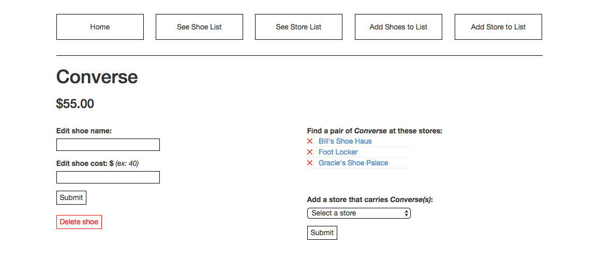
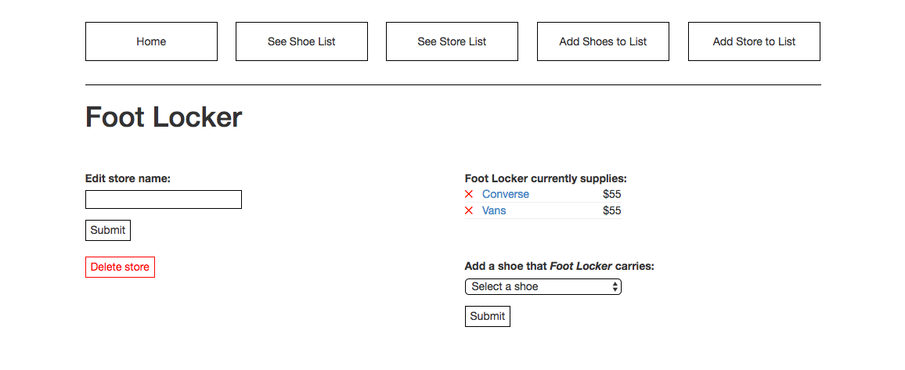

# Shoe Retailer Databae

Shoe Retailer Database is a web app used to track brands of shoes and where they are sold. This project is an assignment focussing on developing applications using ActiveRecord and Sinatra, built with Ruby. The schema contains a _many to many_ relationship between Shoes, and Stores.

<kbd></kbd>
<kbd></kbd>

### Prerequisites

Ruby  
Bundler  

### Usage

### Built With

* Ruby
* ActiveRecord
* Sinatra
* HTML, CSS, Jquery

### Created by / contact info
Sean Pierce  
_sumler.sean@gmail.com_

_License MIT_  
Copyright &copy; Sean Pierce
